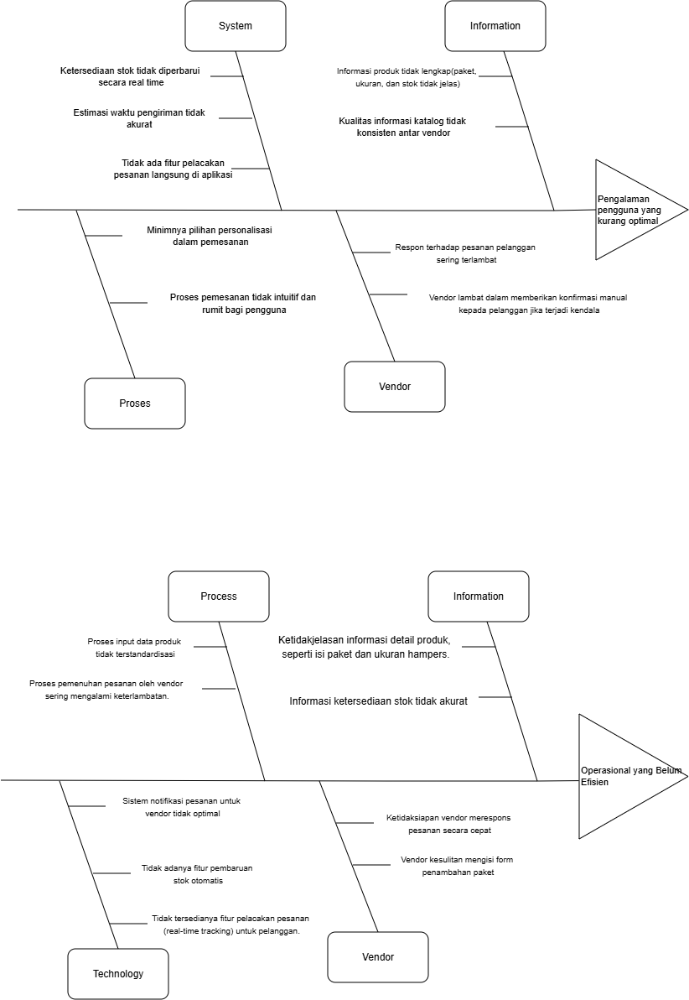
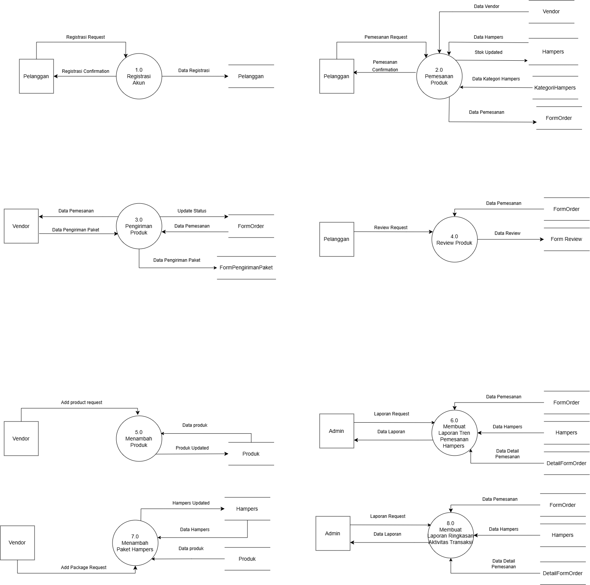
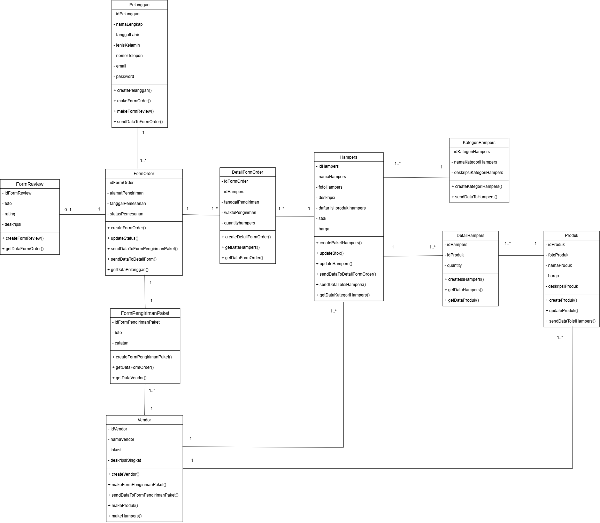
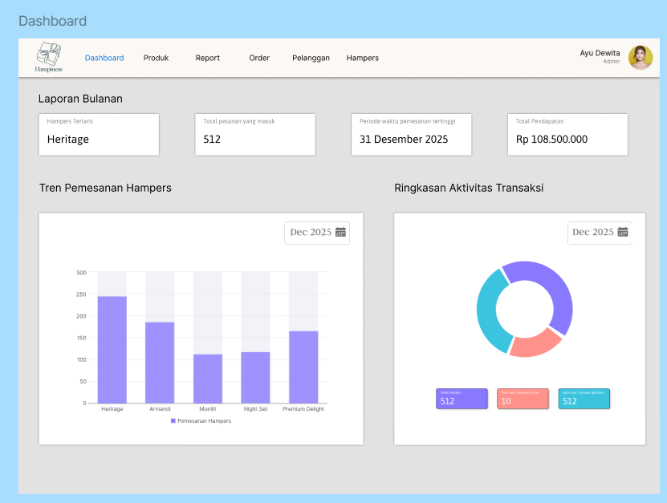
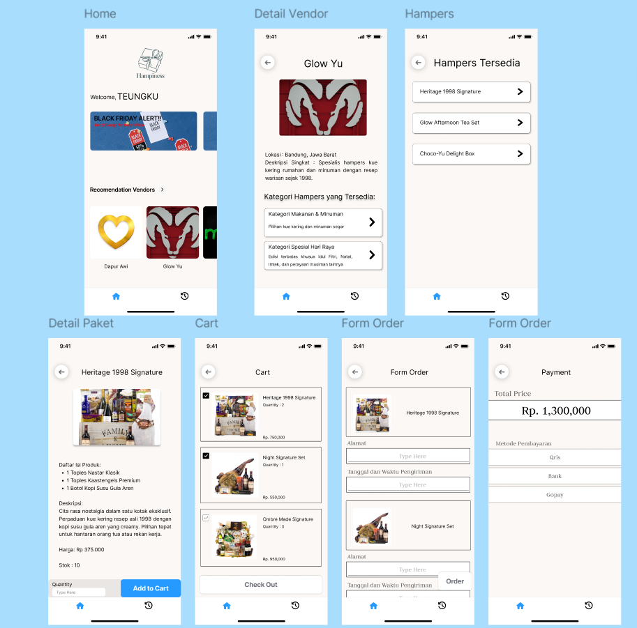

# Hampiness 
An end-to-end Information Systems Analysis and Design (ISAD) case study for "Hampiness", a multi-vendor hampers marketplace platform. This repository covers root-cause problem identification, data flow modeling, object-oriented software design, UI mockups for mobile and web, and 3-tier client/server architecture specifications.

## Project Overview
Hampiness connects buyers with multiple local gift and hampers vendors. It addresses common manual operational hurdles, including:
* Inconsistent product catalog information across multiple vendors.
* Delayed manual vendor order confirmations.
* Discrepancies in inventory tracking for customizable and bundled gift sets.
* Lack of centralized tracking and automated transaction reporting.

The system specification outlines a comprehensive multi-stakeholder platform catering to **Customers (B2C)**, **Vendors (B2B)**, and **Internal Platform Administrators**.

## Problem Identification
A **Fishbone Diagram** was formulated across people, process, vendor, information, and technology dimensions to identify the operational barriers affecting customer experience and vendor fulfillment efficiency.

## Process & Data Modeling
Core data transactions and boundary interactions are captured using structured modeling techniques:
* **Context Diagram & Data Flow Diagram (DFD Level 0):** Mapped data exchanges among Customers, Vendors, and Admins across 8 primary processes.
* **Core Workflows:** User Registration, Product & Hamper Catalog Management, Order Placement, Review Handling, Vendor Delivery Confirmation, and Management Reporting.

## Object-Oriented Analysis & Design 
Detailed behavioral and structural specifications modeled using UML:
* **Use Case Diagrams & Descriptions:** Fully detailed operational scenarios, trigger events, preconditions, postconditions, and exception handling for all three actor roles.
* **Activity & Sequence Diagrams:** Mapped chronological communication flows between actors, controllers/handlers, domain entities, and data stores.
* **Class Diagram:** Modeled entities, attributes, visibility, method contracts, and cardinality for vendors, raw products, bundled hampers, orders, shipment forms, and reviews.
* **State Transition Diagrams:** Outlined lifecycle states for order placement, payment validations, and product inventory updates.

## UI Design & High-Fidelity Mockups
Developed static, high-fidelity UI mockups tailored to each role's workflow (designed without transition animations):

* **Customer Mobile Interface (iOS/Android):**
  * Landing page, registration, and authentication views.
  * Vendor exploration, category filtering, and item customization screens.
  * Cart verification, checkout forms, and post-purchase review submissions.

* **Vendor Mobile Interface (iOS/Android):**
  * Product and package bundling forms.
  * Real-time incoming order notifications.
  * Package delivery confirmation screens with proof-of-delivery uploads.

* **Admin Web Dashboard:**
  * Centralized management portal for sales metrics.
  * Monthly hamper ordering trend visualizations and transaction activity summaries.

**Figma:** [Figma Link](https://www.figma.com/design/Zgp8IlleNxnp0Kmv5Wto28/Project-ISAD-Lab?node-id=0-1&t=Imw5PsXKpvbO9Q4o-1)  
**Diagram Source:** [Draw.io Diagram File](https://drive.google.com/file/d/1vINISTcqi9oj_lF9tFopij9vx38L_BGu/view?usp=sharing) 

## System Architecture Specification
Designed using a **3-Tier Client/Server Architecture**:
* **Presentation Tier:** Native/Cross-platform mobile applications for Customers and Vendors (iOS/Android) alongside a Web browser client for Platform Administrators.
* **Application Tier:** Server environment running Java and Swift business logic to handle transaction validations, bundle calculations, and push notifications.
* **Data Tier:** Centralized MySQL relational database managing user records, product catalogs, and transactional order histories.

## Contributors
* Aditya Naufal Erlangga
* Arya Raka Pratama
* Izaty Salsabila
* Thio Michael Yulianto
